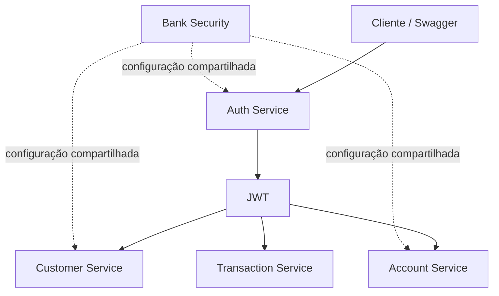

# Bank Microservices

Projeto autoral em **Java 21 e Spring Boot** que simula uma plataforma bancária formada por APIs independentes, bancos PostgreSQL separados e uma biblioteca compartilhada de segurança JWT.

> [!IMPORTANT]
> **Projeto em evolução.** A solução está sendo construída de forma incremental e ainda não representa um sistema bancário finalizado ou pronto para produção. Algumas integrações entre serviços não foram implementadas e o `transaction-service` utiliza dados simulados para conta, status e saldo.

## Visão geral

| Módulo | Responsabilidade | Porta | Estado atual |
| --- | --- | ---: | --- |
| [`customer-service`](customer-service/) | Cadastro e gerenciamento de clientes | 8080 | API e persistência implementadas |
| [`account-service`](account-service/) | Cadastro, status e saldo de contas | 8081 | API e persistência implementadas |
| [`transaction-service`](transaction-service/) | Registro de créditos e débitos | 8082 | Persistência implementada; integração com contas ainda simulada |
| [`auth-service`](auth-service/) | Cadastro, login e emissão de JWT | 8083 | Fluxo básico implementado |
| [`bank-security`](bank-security/) | Auto-configuração reutilizável de segurança JWT | — | Biblioteca local em evolução |



Cada API possui seu próprio banco PostgreSQL. A comunicação real entre `transaction-service` e `account-service` está planejada, mas ainda não foi implementada.

## Tecnologias e práticas

- Java 21 e Spring Boot 3.5
- Spring Web, Spring Data JPA e Bean Validation
- Spring Security e JWT (JJWT)
- PostgreSQL e Flyway
- MapStruct e Lombok
- OpenAPI/Swagger nos serviços de domínio
- Docker e Docker Compose
- JUnit 5, Mockito e testes de integração no `customer-service`
- Organização por feature e separação entre DTOs, comandos, resultados, domínio e persistência

## Como executar

Pré-requisitos: Docker com Compose. Na raiz do repositório:

```bash
docker compose up --build
```

O Compose sobe os quatro bancos e as quatro aplicações. Para encerrar:

```bash
docker compose down
```

### URLs locais

| Serviço | API | Swagger |
| --- | --- | --- |
| Customer | `http://localhost:8080/customers` | `http://localhost:8080/swagger-ui/index.html` |
| Account | `http://localhost:8081/accounts` | `http://localhost:8081/swagger-ui/index.html` |
| Transaction | `http://localhost:8082/transactions` | `http://localhost:8082/swagger-ui/index.html` |
| Auth | `http://localhost:8083/auth` | Não configurado atualmente |

Os endpoints `/auth/**` e a documentação Swagger são públicos. Os demais endpoints são protegidos e esperam `Authorization: Bearer <token>`.

## Limitações conhecidas

- O `transaction-service` aceita atualmente apenas uma conta simulada (`8ad2a0c9-1989-4b89-9728-83ccd96ee18d`), considera seu status ativo e parte de um saldo fixo de `100`.
- A transação ainda não consulta nem atualiza o saldo real do `account-service`.
- Não há service discovery, API Gateway, mensageria ou tratamento de consistência distribuída.
- A cobertura de testes varia entre os módulos; alguns possuem apenas teste de contexto.
- Segredos e credenciais do Compose são exclusivamente locais e demonstrativos.

## Roadmap

- [x] APIs de clientes, contas, autenticação e transações
- [x] Persistência isolada por serviço com PostgreSQL e Flyway
- [x] Autenticação JWT e biblioteca compartilhada
- [x] Ambiente local com Docker Compose
- [ ] Substituir os mocks do fluxo de transações por integração com contas
- [ ] Definir comunicação síncrona e/ou orientada a eventos
- [ ] Adicionar Kafka e idempotência no processamento
- [ ] Ampliar testes unitários, de integração e de contrato
- [ ] Adicionar observabilidade, CI/CD e deploy em nuvem

## Autor

Desenvolvido por **Emmanuel Gomes** como projeto autoral de backend Java e arquitetura de microsserviços.
